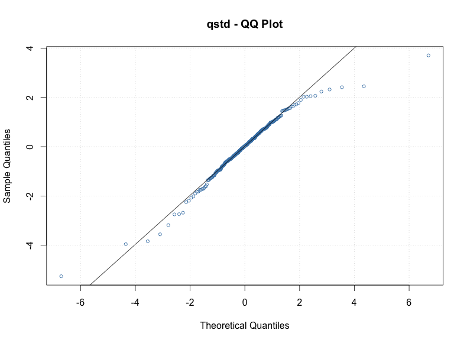
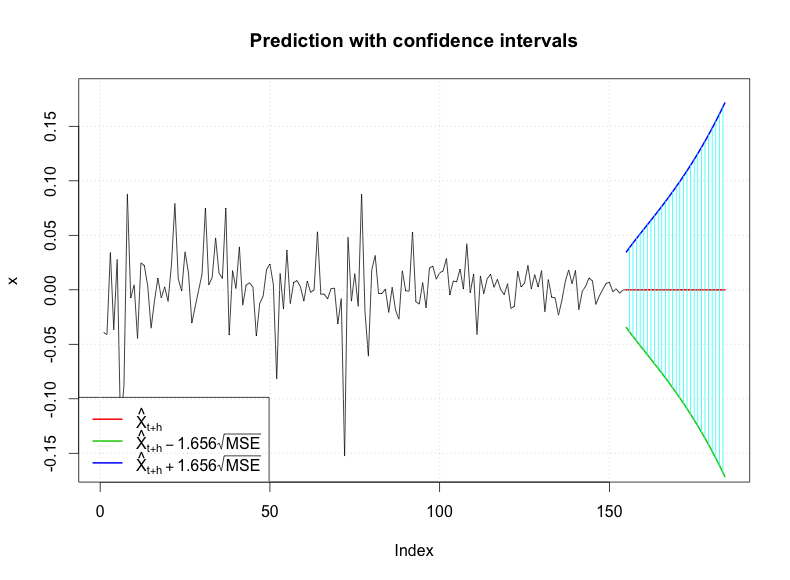

[](http://quantlet.de/index.php?p=info)

## [](http://quantlet.de/) **econ_tgarch** [](http://quantlet.de/d3/ia)

```yaml

Name of QuantLet : econ_tgarch

Published in : EconCrix

Description : Produces student t-GARCH estimation results using ARIMA model residuals.

Keywords : graphical representation, plot, time-series, data visualization, copula

See also : econ_arima, econ_crix, econ_arch, econ_vola

Author : Shi Chen

Submitted : Thur, July 28 2016 by Shi Chen

Datafile : crix.RData

Example : 'The ACF and PACF plots using tGARCH(1,1) model, The QQ plot of tGARCH(1,1) residuals,
The 30 step ahead prediction using tGARCH(1,1) model'

```






### R Code:
```r
NA
```
