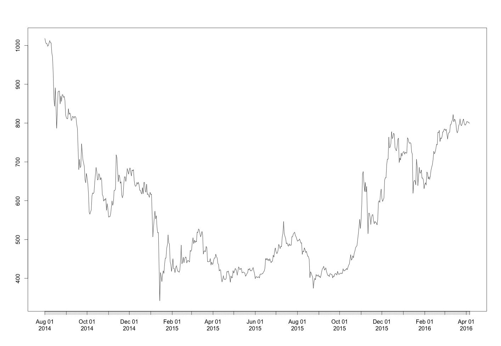
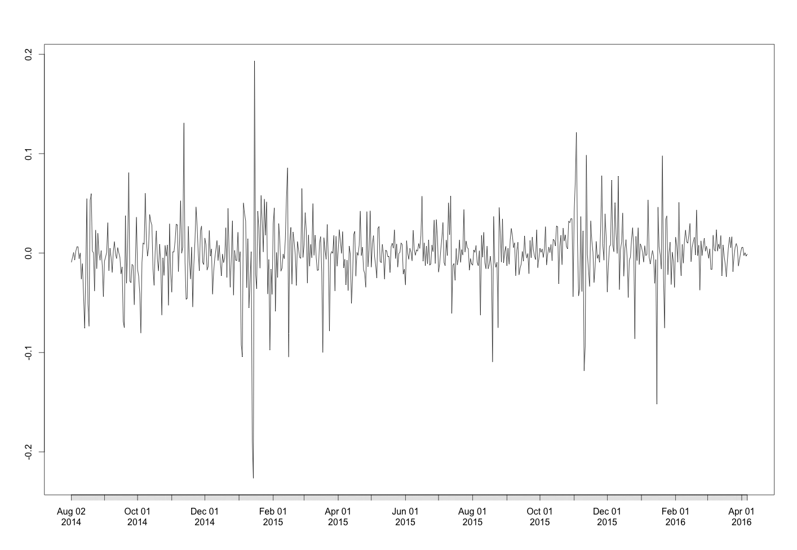

[](http://quantlet.de/index.php?p=info)

## [](http://quantlet.de/) **econ_crix** [](http://quantlet.de/d3/ia)

```yaml

Name of QuantLet : econ_crix

Published in : EconCrix

Description : Produces econometric analysis results using CRIX data.

Keywords : graphical representation, plot, time-series, data visualization, copula

See also : econ_arima, econ_arch, econ_garch, econ_vola

Author : Shi Chen

Submitted : Thur, July 28 2016 by Shi Chen

Datafile : crix.RData

Example : 'The CRIX price process., The CRIX return process., The histogram and QQ plots of CRIX
return.'

```






### R Code:
```r
rm(list = ls(all = TRUE))
graphics.off()

# install and load packages
libraries = c("zoo", "tseries", "xts")
lapply(libraries, function(x) if (!(x %in% installed.packages())) {
  install.packages(x)
})
lapply(libraries, library, quietly = TRUE, character.only = TRUE)

# load dataset
load(file = "crix.RData")

# plot of crix
# plot(as.xts(crix), type="l", auto.grid=FALSE, main = NA)
plot(crix1, ylab = NA, xlab = NA)

# plot of crix return
ret   = diff(log(crix1))
# plot(as.xts(ret), type="l", auto.grid=FALSE, main = NA)
plot(ret, ylab = NA, xlab = NA)

mean(ret)
var(ret)
sd(ret)

# histogram of price
hist(crix, col = "grey", breaks = 40, freq = FALSE)
lines(density(crix), lwd = 2)

par(mfrow = c(1, 2))
# histogram of returns
hist(ret, col = "grey", breaks = 20, freq = FALSE, ylim = c(0, 25), xlab = NA)
lines(density(ret), lwd = 2)
mu = mean(ret)
sigma = sd(ret)
x = seq(-4, 4, length = 100)
curve(dnorm(x, mean = mean(ret), sd = sd(ret)), add = TRUE, col = "darkblue", 
      lwd = 2)
# qq-plot
qqnorm(ret)
qqline(ret, col = "blue", lwd = 3)

# normality test
ret1 = diff(log(crix))
ks.test(ret1, "pnorm", mean(ret), sd(ret))
shapiro.test(ret1)

```
