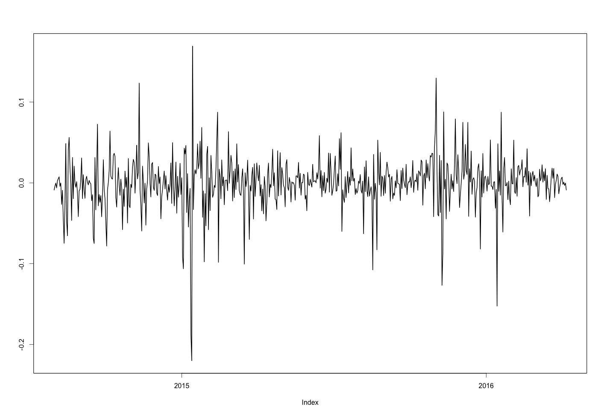

[](http://quantlet.de/index.php?p=info)

## [](http://quantlet.de/) **econ_garch** [](http://quantlet.de/d3/ia)

```yaml

Name of QuantLet : econ_garch

Published in : EconCrix

Description : 'Produces GARCH estimation results using ARIMA model residuals.'

Keywords : 
- graphical representation
- plot 
- time-series
- data visualization
- garch
- forecast
- estimation

See also : 'econ_arima, econ_crix, econ_arch, econ_vola'

Author : Shi Chen

Submitted : Thur, July 28 2016 by Shi Chen

Datafile : 'crix.RData'

Example : 
- The ARIMA-GARCH model residuals.
- The ACF and PACF plots using GARCH(1,1) model
- The ACF and PACF plots using GARCH(1,2) model 
- The QQ plot of GARCH(1,1) residuals.


```




### R Code:
```r
rm(list = ls(all = TRUE))
graphics.off()

# install and load packages
libraries = c("FinTS", "tseries", "forecast", "fGarch")
lapply(libraries, function(x) if (!(x %in% installed.packages())) {
  install.packages(x)
})
lapply(libraries, library, quietly = TRUE, character.only = TRUE)

# load dataset
load(file = "crix.RData")
ret = diff(log(crix1))

# vol cluster
fit202 = arima(ret, order = c(2, 0, 2))
par(mfrow = c(1, 1))
res = fit202$residuals
res2 = fit202$residuals^2

# different garch model
fg11 = garchFit(data = res, data ~ garch(1, 1))
summary(fg11)
fg12 = garchFit(data = res, data ~ garch(1, 2))
summary(fg12)
fg21 = garchFit(data = res, data ~ garch(2, 1))
summary(fg21)
fg22 = garchFit(data = res, data ~ garch(2, 2))
summary(fg22)

# residual plot
reszo = zoo(fg11@residuals, order.by = index(crix1))
plot(reszo, ylab = NA, lwd = 2)

par(mfrow = c(1, 2))
fg11res2 = fg11@residuals
acfres2  = acf(fg11res2, lag.max = 20, ylab = "Sample Autocorrelation", 
              main = NA, lwd = 2)
pacfres2 = pacf(fg11res2, lag.max = 20, ylab = "Sample Partial Autocorrelation", 
                main = NA, lwd = 2, ylim = c(-0.5, 0.5))

fg12res2 = fg12@residuals
acfres2  = acf(fg12res2, lag.max = 20, ylab = "Sample Autocorrelation", 
              main = NA, lwd = 2)
pacfres2 = pacf(fg12res2, lag.max = 20, ylab = "Sample Partial Autocorrelation", 
                main = NA, lwd = 2, ylim = c(-0.5, 0.5))

# qq plot
par(mfrow = c(1, 1))
plot(fg11, which = 13)  #9,10,11,13

# kp test
set.seed(100)
x = rnorm(200)

# Do x and y come from the same distribution?
ks.test(x, fg11@residuals)

```
