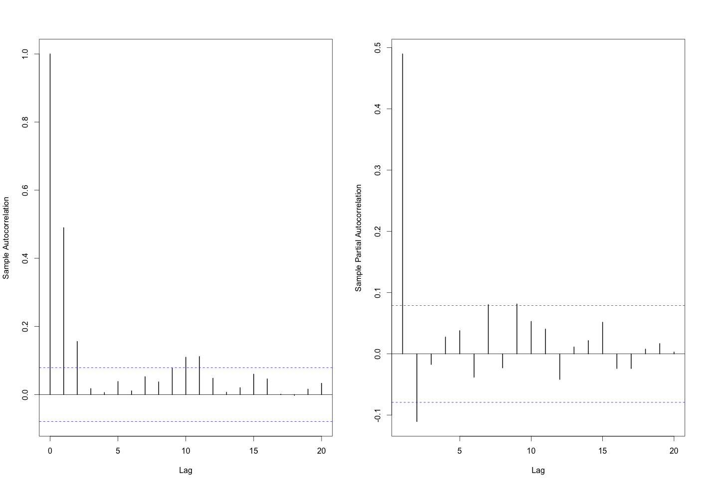

[](http://quantlet.de/index.php?p=info)

## [](http://quantlet.de/) **econ_vola** [](http://quantlet.de/d3/ia)

```yaml

Name of QuantLet : econ_vola

Published in : EconCrix

Description : 'Produces volatility clustering plot of Crix return, ACF and PACF plots of squared residuals derived from ARIMA model.'

Keywords : 
- graphical representation
- plot 
- time-series
- data visualization
- volatility

See also : 'econ_arima, econ_crix, econ_garch, econ_arch'

Author : Shi Chen

Submitted : Thur, July 28 2016 by Shi Chen

Datafile : 'crix.RData'

Example : 
- The volatility clustering plot
- The comparison of different Crix returns
- The ACF and PACF of squared residuals.

```





### R Code:
```r
rm(list = ls(all = TRUE))
graphics.off()

# install and load packages
libraries = c("FinTS", "tseries")
lapply(libraries, function(x) if (!(x %in% installed.packages())) {
  install.packages(x)
})
lapply(libraries, library, quietly = TRUE, character.only = TRUE)

# please change your working directory
setwd()

load(file = "crix.RData")
Pr = as.numeric(crix)
Da = factor(date1)
crx = data.frame(Da, Pr)

# plot of crix return
ret = diff(log(crx$Pr))
Dare = factor(date1[-1])
retts = data.frame(Dare, ret)

# comparison of different crix returns
par(mfrow = c(2, 2))
plot(crx$Da, crx$Pr, type = "o")
lines(crx$Pr)
plot(crx$Da, log(crx$Pr), type = "o")
lines(log(crx$Pr))
plot(retts$Dare, diff(crx$Pr), type = "o")
lines(diff(crx$Pr))
plot(retts$Dare, retts$ret, type = "o")
lines(retts$ret)

# ARIMAfit <- auto.arima(ret, approximation=FALSE,trace=FALSE)
# summary(ARIMAfit)

# arima202 predict
fit202 = arima(ret, order = c(2, 0, 2))

# vola cluster
par(mfrow = c(1, 1))
res = fit202$residuals
res2 = fit202$residuals^2
tsres202 = data.frame(Dare, res2)
plot(tsres202$Dare, tsres202$res2, type = "o", ylab = NA)
lines(tsres202$res2)

par(mfrow = c(1, 2))
# plot(res2, ylab='Squared residuals', main=NA)
acfres2 = acf(res2, main = NA, lag.max = 20, ylab = "Sample Autocorrelation", 
              lwd = 2)
pacfres2 = pacf(res2, lag.max = 20, ylab = "Sample Partial Autocorrelation", 
                lwd = 2, main = NA)

# arch effect
res = fit202$residuals
ArchTest(res)  #library FinTS
Box.test(res2, type = "Ljung-Box")

```
